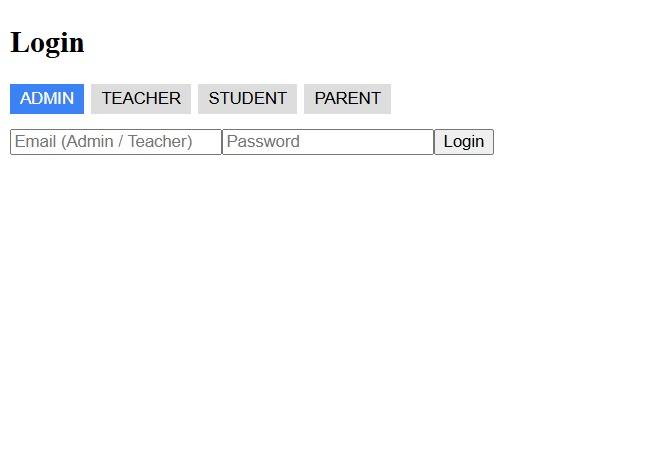
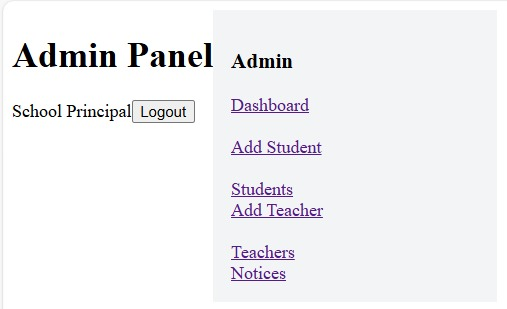
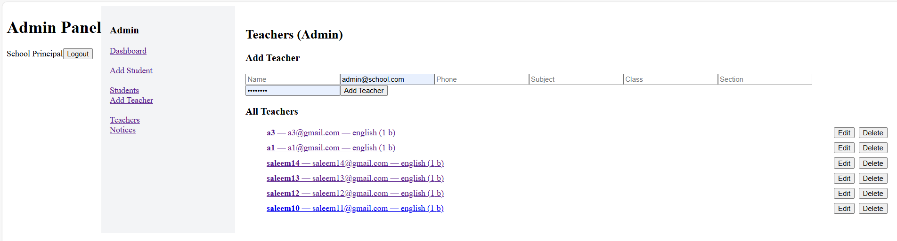
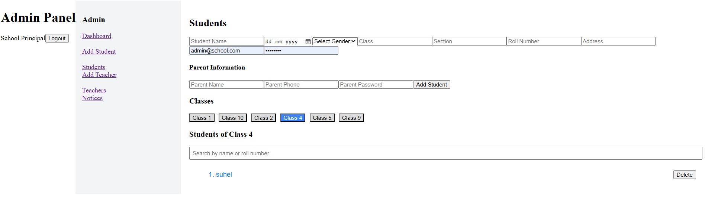
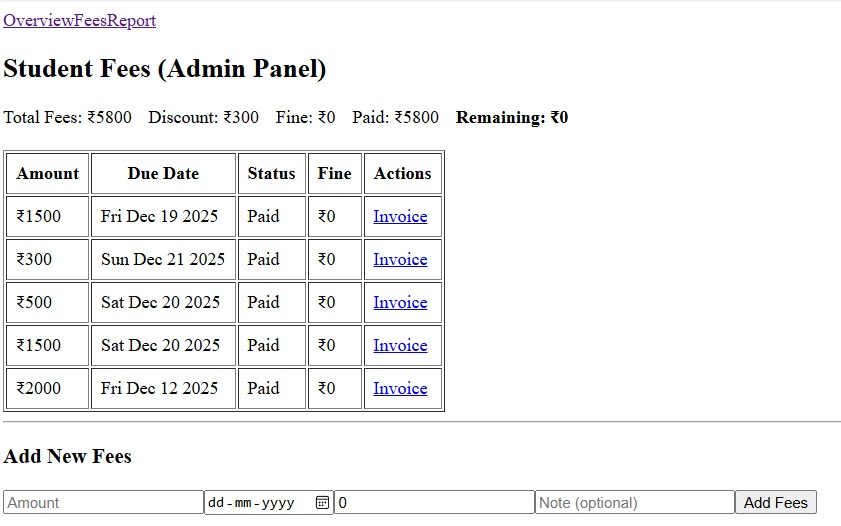

# College ERP Management System (MERN Stack)

A full-stack **College ERP Management System** designed to manage academic and administrative workflows such as students, teachers, attendance, fees, notices, and events with proper role-based access.

This project follows **real-world ERP logic** used by colleges and educational institutions.

---

## 🚀 Features

### 🔐 Role-Based Access
- **Admin**: Full control over students, teachers, fees, attendance, notices, and events
- **Teacher**: Mark attendance, view assigned classes, manage academic data
- **Student**: View attendance percentage, fees status, notices, and events
- **Parent**: Monitor student attendance, fees, and important announcements

---

### 👨‍🎓 Student Management
- Add, update, and manage student records
- Class-wise and roll number-based organization
- Secure login credentials for students and parents

---

### 👩‍🏫 Teacher Management
- Teacher profile management
- Subject and class assignment
- Secure role-based login

---

### 📝 Attendance Management
- Teachers can mark daily attendance
- Automatic attendance percentage calculation
- Attendance visibility for students and parents

---

### 💰 Fee Management (ERP Logic)
- Fee assignment (not direct payment)
- Discounts / scholarships support
- Late fee fine calculation
- Paid vs pending fee tracking
- Remaining fee calculation
- Invoice PDF generation

> Fees follow **accounting-safe ERP flow**:
> Assign Fees → Receive Payment → Mark Paid

---

### 📢 Notices & Events
- Admin can create notices and events (meetings, functions, holidays, etc.)
- Events and notices visible to students and parents
- Designed for real college communication needs

---

## 🛠️ Tech Stack

**Frontend**
- React.js
- React Router
- Axios

**Backend**
- Node.js
- Express.js
- REST APIs

**Database**
- MongoDB (Mongoose)

**Authentication & Security**
- JWT Authentication
- Role-Based Authorization

---

## 📸 Screenshots

**Roll-Based-Access**

**Admin-Dashboard**

 
**Add-Teacher**

**Add-Student**

**Notices**

**Fees Management**

